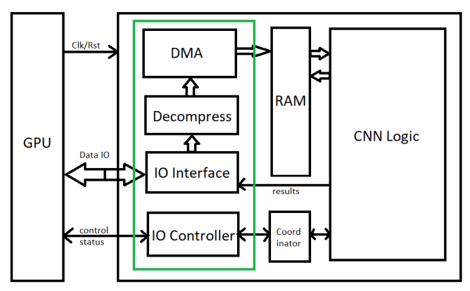
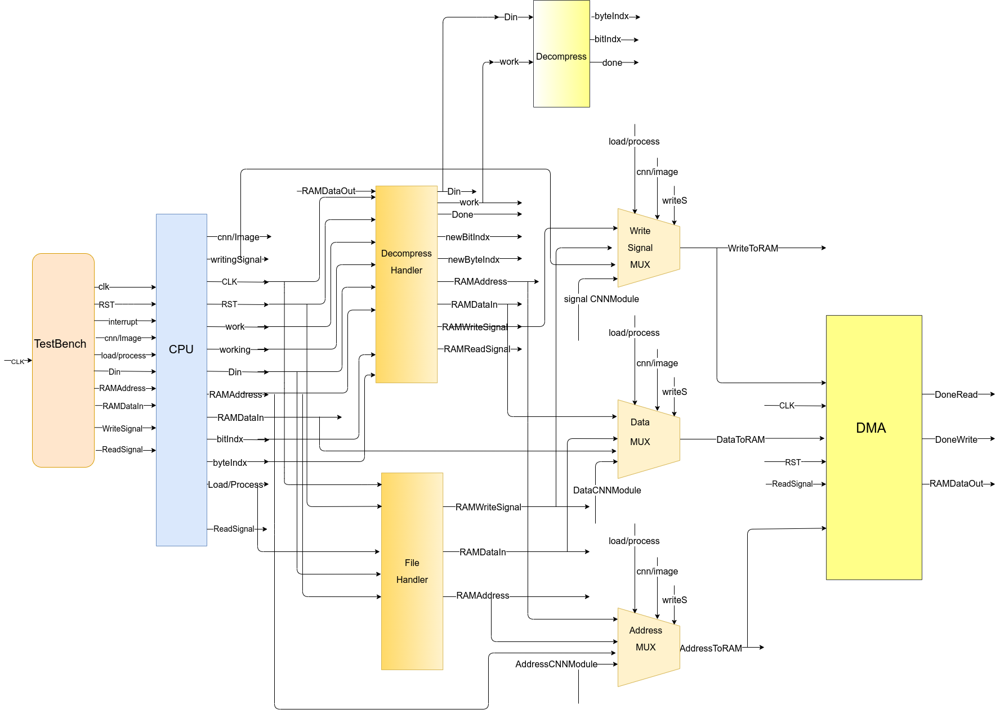

# DCNN IO module
It's a detailed hardware design for the I/O module that is built for sending/receiving data over a 16-bit bus interface with the CPU.
 
 

 
 
The CPU compress the input image (BMP file) and the CNN classifier (JSON file), then send them over a 16-
bit parallel bus. Moreover, the CPU uses additional control signals to control the chip (for example: an
interrupt signal to notify the chip that a new command will be sent). The CPU sends control signals & data,
and receives status signals & result. The I/O module receives the CPU commands & data, decompress the
image & CNN, and pass the commands to the rest of the chip.

# Design:

# I/O Modules:
### CPU/Coordinator:
- Initialize all modules
- Handle DMA write/read on ram
- Send data to corresponding module
- Receive signals from test bench/external CPU
### Decompress:
- Decompress RLE byte to corresponding right data
- Save decompressed data to a buffer
### Decompress-Handler:
- Send compressed word to decompress module
- Write data stored in the buffer to right position in ram
### File-Handler:
- Write data read from the CNN parameter Files to ram
### DMA:
- Handler reads/writes to RAM/MEMORY
### Write signal MUX:
- Determine which module write signal will be sent to the DMA
### Data MUX:
- Determine which module data will be passed to DMA
### Address MUX:
- Determine which module ram address will be passed to DMA

### Synthesis and routing for: 
* DMA
* Decompress
* CPU

# Python scripts:
### compress.py
- Compress the input image with RLE (run length encoding).
### FloatToBin.py
- Convert CNN files from float to binary to write in the ram knowing that for each float number, the integer part is encoded in 5 bits and the decimal part is encoded in 11 bits (total 16 bits).
### compare.py
- Compare data written in ram by the data in the text files (image and CNN files).

# Tools & Technelogies:
- Verilog 
- Python3
- modelsim
- Oasys
- Nitro

# Contributers:
- Bahaa El-deen Mohamed Elsayed
- Dai Alaa Hassan
- Dina Alaa Ahmed
- Nerdeen Ahmad Shawqi

